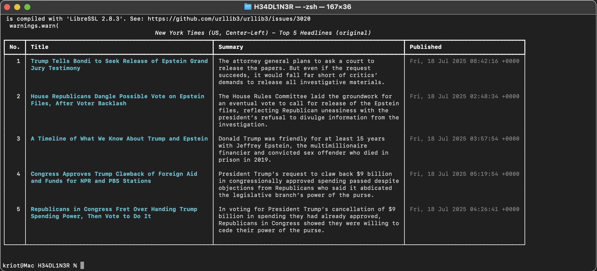

# H3ADL1N3R

**H3ADL1N3R** is a reliable and user-friendly Python tool that aggregates the latest top headlines from multiple major news outlets across the UK, USA, and Italy using their official RSS feeds.

Designed for beginners and professionals alike, it leverages structured data feeds to deliver unbiased, diverse perspectives on current events while avoiding fragile HTML scraping techniques.

For educational and ethical use only.




## Features

- Aggregates top headlines from 9+ reputable news sources spanning UK, US, and Italy  
- Supports filtering by news source(s) via command-line arguments  
- Clean, readable terminal output with color and tables using the `rich` library  
- Fetches headline title, publication date, and direct article link  
- Lightweight, stable, and easy to extend

## Requirements

- Python 3.6 or higher  
- Python packages:  
  - `feedparser` (for parsing RSS feeds)  
  - `rich` (for enhanced terminal output)  

Install dependencies with:

```bash
pip3 install -r requirements.txt
```

## Usage

Run the scraper without arguments to fetch headlines from all sources with the default 5 headlines each:

```bash
python3 headliner.py
```

Or specify one or more sources by their keys and optionally set how many headlines to fetch per source:

```bash
python3 headliner.py --source cnn fox ansa --count 10
```

## Available news source keys

- UK: `bbc`
- USA: `nyt`, `fox`, `breitbart`, `npr`
- ITALY: `ansa`, `corriere`, `repubblica`, `la stampa`, `tgcom24`

## Legal and ethical notice

This tool is intended solely for educational purposes. 
Always respect website terms of service and robots.txt directives. Avoid excessive or abusive requests to news servers.
