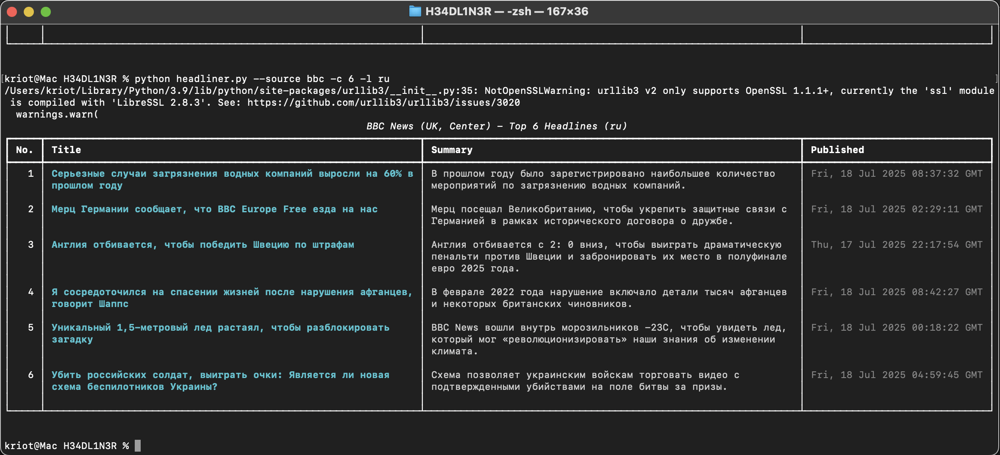

**H3ADL1N3R** is a powerful, terminal-based Python tool that fetches and displays the latest headlines from a broad range of international news sources using official RSS feeds.

It supports translation, summary previews, and region-based filtering — making it a flexible and fast solution to monitor news narratives across political spectrums and countries.

For educational and ethical use only.

  


## 🚀 Features

- Aggregates headlines from 25+ reliable outlets across:
- UK, USA, Italy, France, Germany, Poland, Hungary
- China, Japan
- Brazil, Argentina
- Filter by one or more sources (e.g. just Italian or Left-leaning US news)
- Auto-generates summaries using the feed's metadata
- Translate headlines and summaries into any language (e.g., `it`, `es`, `fr`, `ru`)
- Elegant output using `rich` with color, tables, and hyperlinks
- Easy to extend and maintain (no HTML scraping, pure RSS)

---

## 📦 Requirements

- Python 3.7+
- Python packages:
  - `feedparser` – RSS parsing
  - `rich` – terminal display
  - `deep-translator` – optional translation

Install everything with:

```bash
pip install -r requirements.txt
```

Your `requirements.txt` should contain:

```text
feedparser
rich
deep-translator
```

## 🛠️ Usage

### 🔹 Basic: fetch from all sources (5 headlines each)

```bash
python headliner.py
```

### 🔹 Custom sources & headline count

```bash
python headliner.py --source fox ansa clarin --count 10
```

### 🔹 Translate results

```bash
python headliner.py --lang it
```

Or combine:

```bash
python headliner.py -s guardian nyt france24 -c 3 -l fr
```

## 🗂️ Available source keys

### 🇬🇧 United Kingdom  
`bbc`, `telegraph`, `daily_mail`, `independent`, `guardian`, `new_statesman`

### 🇺🇸 United States  
`nyt`, `fox`, `breitbart`, `npr`, `wash_ex`, `national_review`, `mother_jones`, `the_intercept`, `msnbc`

### 🇮🇹 Italy  
`ansa`, `corriere`, `repubblica`, `la_stampa`, `tgcom24`

### 🇫🇷 France  
`france24`, `le_monde`

### 🇩🇪 Germany  
`dw`, `faz`

### 🇵🇱 Poland  
`tvn24`, `gazeta`

### 🇭🇺 Hungary  
`hungary_today`

### 🇨🇳 China  
`xinhuanet`

### 🇯🇵 Japan  
`japan_times`, `nhk`

### 🇧🇷 Brazil  
`folha`, `globo`

### 🇦🇷 Argentina  
`clarin`

## ⚖️ Legal & Ethical Notice

This tool is intended strictly for **personal educational use**.

- Always respect the [Terms of Service](https://www.nytimes.com/content/help/rights/terms/terms-of-service.html) and `robots.txt` of any website you query.
- Do not run this tool too frequently or in parallel.
- Use it to gain insight — not to republish or redistribute content.